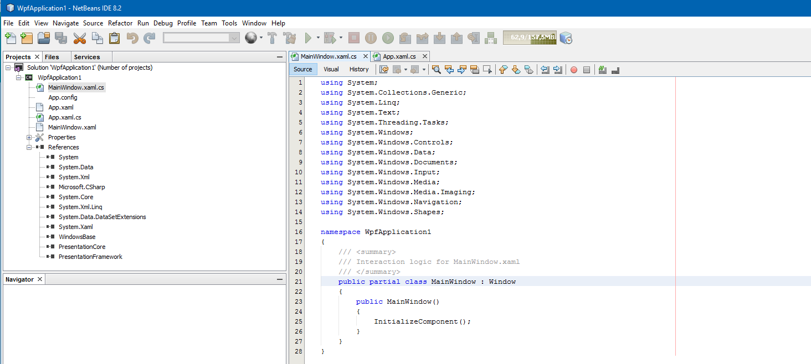

<h1>CSharp-for-netbeans (WORK IN PROGRESS)</h1>
Brings C# support to netbeans (Create projects, open Projects, etc.)

<h2>Started and on a good way to finish it soon</h2>
<ol>
    <li>Open a Solution (.sln) created from Visual Studio</li>
    <li>Create a C# Project with Netbeans (Added new project type)</li>
    <li>Opens the project with all files</li>
    <li>New filetypes where added (.cs, .config)</li>
    <li>List of resources are available as nodes in the project view</li>
</ol>

<h2>TODO</h2>
<ol>
    <li>Enhance the csproj and sln file to work better with netbeans and visual studio, some parts are missing atm</li>
    <li>Implement Lexer/Parser for Syntax Highlighting .cs files / code</li>
    <li>Implement NuGet package manager to it</li>
    <li>To be continued...</li>
</ol>